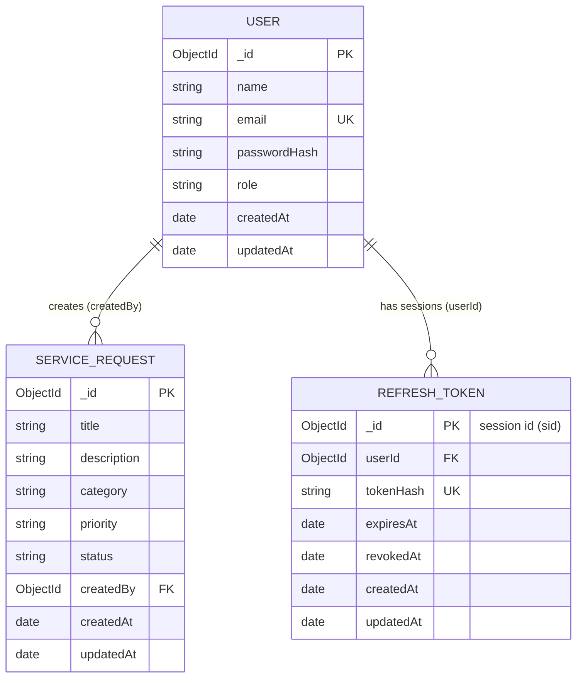

# RequestHub

A full-stack service request management system. Users report problems as service requests and track them; administrators review every request and move it through a controlled status workflow.

## Table of Contents

1. [Project Overview](#1-project-overview)
2. [Objectives](#2-objectives)
3. [Features](#3-features)
4. [Technology Stack](#4-technology-stack)
5. [Architecture](#5-architecture)
6. [Database Design](#6-database-design)
7. [Authentication & Authorization](#7-authentication--authorization)
8. [Business Rules](#8-business-rules)
9. [API Reference](#9-api-reference)
10. [Environment Variables](#10-environment-variables)
11. [Installation & Setup](#11-installation--setup)
12. [Running the Application](#12-running-the-application)
13. [Running Tests](#13-running-tests)
14. [Postman API Documentation](#14-postman-api-documentation)
15. [Assumptions](#15-assumptions)
16. [Known Limitations](#16-known-limitations)
17. [Future Improvements](#17-future-improvements)

## 1. Project Overview

RequestHub has two roles:

- **USER**: registers an account, submits service requests (for example "Laptop will not boot"), follows their progress, edits them while they are still pending and cancels them while they are open.
- **ADMIN**: sees every request, searches and filters them, moves each one through the status workflow (`PENDING` → `IN_PROGRESS` → `RESOLVED`, or `CANCELLED`) and lists the registered users.

The repository contains two applications:

```text
.
├── backend/    Node.js + Express REST API (MongoDB via Mongoose)
├── frontend/   React + Vite single-page application
└── docs/       Postman collection documenting the API
```

The backend is the single source of truth: authentication, roles, ownership, validation and the status workflow are all enforced by the API. The frontend mirrors those rules only to decide which actions to show.

## 2. Objectives

- Provide a working system in which users submit service requests and administrators process them.
- Keep sessions secure: tokens live only in HttpOnly cookies, sessions can be revoked immediately, and refresh tokens rotate on every use.
- Separate **authentication** (who you are, `401`), **authorization** (what your role may do, `403`) and **ownership** (which records you may touch, `404`).
- Enforce the request status workflow in one place on the server, so no client can skip or reverse a step.
- Validate all input on the server and return consistent, predictable JSON responses and error messages.
- Cover the API with automated tests, and document it with a README and a Postman collection.

## 3. Features

### For USERs

- Register an account and log in.
- Create a service request with a title, description, category and optional priority.
- See their own requests, 10 per page, and open the details of each one.
- Edit a request while it is still `PENDING`.
- Cancel a request while it is `PENDING` or `IN_PROGRESS`.

### For ADMINs

- See every request with its owner, with free-text search, status/category/priority filters, sorting and pagination.
- Change a request's status, only to the next statuses the workflow allows.
- List all users with their role and join date.

### Security

- JWT access token (15 minutes) and rotating refresh token (7 days), both in `HttpOnly`, `SameSite=Lax` cookies.
- Server-side sessions: logout and refresh revoke a session immediately.
- Passwords hashed with bcrypt (cost 12); refresh tokens stored only as SHA-256 hashes.
- Login does not reveal which emails are registered (same message and similar timing).
- Roles always read from the database, never from the token.
- `helmet` security headers, strict CORS for a single origin, 10 kB JSON body limit.

### User interface

- Role-aware navigation, protected and public routes, and an automatic, one-time session refresh when the access token expires.
- Responsive layout (cards on small screens, tables from the `md` breakpoint), toast notifications, loading, empty and error states.
- Form validation that mirrors the backend and shows the backend's field errors.

## 4. Technology Stack

| Layer | Technology |
| ----- | ---------- |
| Frontend | React 19, Vite 8, React Router 7, Tailwind CSS 4 (`@tailwindcss/vite`) |
| Backend | Node.js 20+, Express 5 (ES modules) |
| Database | MongoDB with Mongoose 9 |
| Authentication | `jsonwebtoken` (HS256 access tokens), `bcrypt` (password hashing), `cookie-parser` |
| Security middleware | `helmet`, `cors` |
| Configuration | `dotenv`, validated in `backend/src/config/env.js` |
| Testing | Jest 30, Supertest, `mongodb-memory-server` |
| Development | `nodemon` |
| API documentation | Postman collection (`docs/RequestHub.postman_collection.json`) |
| Language | JavaScript |

## 5. Architecture

### System overview

```text
Browser: React SPA (http://localhost:5173)
   │  fetch(..., { credentials: 'include' }), HttpOnly auth cookies sent automatically
   ▼
Express API (http://localhost:5000/api)
   helmet → cors (CLIENT_ORIGIN, credentials) → express.json (10 kB) → cookie-parser
   → route → authenticate (401) → authorize(roles) (403)
   → controller → validator (400) → service (ownership 404, business rules 409) → Mongoose model
   → error middleware (uniform JSON error responses)
   ▼
MongoDB (users, refreshtokens, servicerequests)
```

### Backend layers

| Layer | Location | Responsibility |
| ----- | -------- | -------------- |
| App setup | `src/app.js` | Middleware, routes and error handling. It does not connect to the database or listen on a port, so tests can import it directly. |
| Server | `src/server.js` | Connects to MongoDB, then starts the HTTP server. |
| Configuration | `src/config/env.js`, `src/config/database.js` | Loads and validates every environment variable; MongoDB connection. |
| Routes | `src/routes/` | URL → middleware → controller. Roles are checked here with `authorize(...)`. |
| Middleware | `src/middleware/auth.middleware.js`, `error.middleware.js` | `authenticate` (401), `authorize` (403), 404 handler and central error handler. |
| Controllers | `src/controllers/` | Thin HTTP handlers: validate input, call a service, shape the response. |
| Validators | `src/validators/` | Plain functions that read only known fields, return cleaned values or throw `400`. |
| Services | `src/services/` | Business logic: registration, login, refresh, logout; request ownership, editing, cancelling and status changes. |
| Models | `src/models/` | Mongoose schemas: `User`, `RefreshToken`, `ServiceRequest`. |
| Constants | `src/constants/request.constants.js` | Categories, priorities, statuses and the status transition table. |
| Utilities | `src/utils/` | `AppError`, token helpers (`tokens.js`), auth cookie helpers (`cookies.js`). |
| Scripts | `src/scripts/seed-admin.js` | Creates the first ADMIN account. |
| Tests | `tests/` | Jest + Supertest API and unit tests. |

Express 5 forwards rejected promises to the error handler, so controllers and middleware simply `throw` an `AppError(status, message, errors?)` and never need `try/catch`. The error handler also converts invalid MongoDB ids (`400 Invalid ID`), duplicate keys (`409`), malformed JSON (`400`) and oversized bodies (`413`); anything unexpected becomes `500 Internal server error` without leaking details.

### Frontend structure

| Location | Contents |
| -------- | -------- |
| `src/api/` | Every call to the API: `client.js` plus `auth.api.js`, `requests.api.js`, `users.api.js` |
| `src/context/` | `AuthContext` (who is logged in) and `ToastContext` (notifications) |
| `src/pages/` | One component per route |
| `src/components/` | Shared components and the route guards |
| `src/constants.js` | Mirrors the backend's categories, priorities, statuses and transition table, plus display labels |
| `src/hooks/useDocumentTitle.js` | Sets the browser tab title for each page |
| `src/index.css` | Tailwind CSS, the colour palette (`@theme`) and shared button and form classes |

#### API layer

Pages and components never call `fetch` themselves. They call the functions in `src/api/*.api.js`, which all go through `request(path, { method, body, params })` in `src/api/client.js`:

- Every call sends `credentials: 'include'`, so the browser stores and sends the HttpOnly auth cookies. A `body` is sent as JSON; `params` become the query string, skipping `undefined`, `null` and empty values (so an "All" filter is simply left out).
- A success returns the parsed response body. A failure throws an `Error` whose `message` is the backend's `message` (or `Something went wrong`), with `status` set to the HTTP status and `errors` set to the backend's per-field errors, if any. If the server cannot be reached, the message is `Cannot reach the server. Please try again.`
- Session refresh is handled here (see [Authentication & Authorization](#7-authentication--authorization)).

| File | Functions |
| ---- | --------- |
| `auth.api.js` | `register`, `login`, `logout`, `getMe` |
| `requests.api.js` | `getRequests`, `getRequest`, `createRequest`, `updateRequest`, `cancelRequest`, `updateRequestStatus` |
| `users.api.js` | `getUsers` |

#### Pages

| Route | Role | Page | Purpose |
| ----- | ---- | ---- | ------- |
| `/login` | Logged out | `LoginPage` | Log in, then go to the user's home page |
| `/register` | Logged out | `RegisterPage` | Create a USER account, then go to `/login` |
| `/` | Any logged-in user | – | Redirects to the user's home page |
| `/requests` | USER | `MyRequestsPage` | The user's own requests, 10 per page, with a **New request** button |
| `/requests/new` | USER | `NewRequestPage` | Create a request |
| `/requests/:id` | USER (own) or ADMIN | `RequestDetailsPage` | All details of one request. A USER can edit or cancel it; an ADMIN also sees the owner and can change the status |
| `/requests/:id/edit` | USER | `EditRequestPage` | Edit a `PENDING` request; any other status shows "This request can no longer be edited" |
| `/admin/requests` | ADMIN | `AdminRequestsPage` | Every request with an owner column, search, status/category/priority filters, sorting and pagination |
| `/admin/users` | ADMIN | `AdminUsersPage` | Every user with name, email, role and joined date |
| any other path | Anyone | `NotFoundPage` | "Page not found" with a link home |

All logged-in pages share the `Layout`. Each page sets the browser tab title through `useDocumentTitle`, for example `My Requests | Service Requests`.

#### Shared components

| Component | Purpose |
| --------- | ------- |
| `Layout`, `Navbar` | Frame for every logged-in page: role-aware links, the user's name and **Log out**. Below the `md` breakpoint the links collapse behind a **Menu** button (`aria-expanded`). |
| `RequestList` | Requests as stacked cards on small screens and a table from `md` upwards; each links to its details page. Shows an owner column when `showOwner` is set (admin list). |
| `RequestForm` | Create and edit form. Checks the same limits as the backend before sending, and shows the backend's field errors (or its message) if the API rejects the data. |
| `RequestActions` | The USER's **Edit** and **Cancel request** buttons on the details page. |
| `StatusUpdateForm` | The ADMIN's status `<select>` and **Update** button on the details page. |
| `StatusBadge`, `PriorityBadge`, `RoleBadge` | Coloured pills that always show a text label, never colour alone. |
| `Pagination` | **Previous** / **Next** and "Page X of Y"; hidden when there is only one page. |
| `FilterSelect` | A labelled `<select>` with an "All" option, used by the admin filters. |
| `Loader`, `EmptyState`, `ErrorMessage` | Loading, empty and error states; `ErrorMessage` can show a **Retry** button. |
| `AuthCard` | Centred card used by the login and register pages. |
| `ToastList` | Success and error notifications, shown by `ToastProvider` (used through `useToast()`). Each disappears after about 3 seconds and can be dismissed. |

Colours come only from the palette tokens defined in the `@theme` block of `src/index.css` (Tailwind CSS v4 through the `@tailwindcss/vite` plugin, so there is no `tailwind.config.js`). The same file defines the shared `.btn`, `.btn-primary`, `.btn-secondary`, `.form-label`, `.form-input` and `.form-error` classes and a visible `:focus-visible` outline for keyboard users.

### Frontend and API on the same site

In development the frontend (`http://localhost:5173`) calls the API directly at `http://localhost:5000/api`. These are different origins but the **same site** (ports do not count for cookies), so the `SameSite=Lax` auth cookies are sent, and CORS allows `CLIENT_ORIGIN` with credentials. Two rules follow from this:

- Every API request must include credentials (`fetch(url, { credentials: 'include' })` or axios `withCredentials: true`); otherwise the browser neither stores nor sends the auth cookies.
- Open the app at `http://localhost:5173`, not `http://127.0.0.1:5173`. `127.0.0.1` and `localhost` are different sites, so the cookies would not be sent and CORS would reject the request.

**Production must keep the frontend and the API same-site too**, for example by serving the API under `/api` on the frontend's domain through a rewrite or reverse proxy. If they must live on different sites, the cookies need `SameSite=None` together with `Secure` (see `backend/src/utils/cookies.js`), and CSRF protection has to be revisited.

## 6. Database Design

MongoDB stores three collections, defined as Mongoose models in `backend/src/models/`. Every document has an `_id` (ObjectId) and `createdAt` / `updatedAt` timestamps (`timestamps: true`).



### `users` (`User` model)

| Field | Type | Constraints |
| ----- | ---- | ----------- |
| `name` | String | Required, trimmed, 2–50 characters |
| `email` | String | Required, **unique**, trimmed, stored lower-case |
| `passwordHash` | String | Required, bcrypt hash (cost 12). `select: false`, so it is never loaded unless asked for explicitly |
| `role` | String | `USER` or `ADMIN`, default `USER` |

JSON output removes `_id`, `__v` and `passwordHash` and adds an `id` field.

### `servicerequests` (`ServiceRequest` model)

| Field | Type | Constraints |
| ----- | ---- | ----------- |
| `title` | String | Required, trimmed, at most 100 characters (the API also requires at least 3) |
| `description` | String | Required, trimmed, at most 2000 characters (the API also requires at least 10) |
| `category` | String | Required: `TECHNICAL`, `BILLING`, `ACCOUNT` or `OTHER` |
| `priority` | String | `LOW`, `MEDIUM` or `HIGH`, default `MEDIUM` |
| `status` | String | `PENDING`, `IN_PROGRESS`, `RESOLVED` or `CANCELLED`, default `PENDING` |
| `createdBy` | ObjectId → `User` | Required; the owner, always taken from the logged-in user |

Indexes:

- `{ createdBy: 1, createdAt: -1 }`: a user's own requests, newest first.
- `{ status: 1, createdAt: -1 }`: the admin list filtered by status, newest first.

JSON output keeps MongoDB's `_id` and `__v`.

### `refreshtokens` (`RefreshToken` model)

One document per login session. Its `_id` is the session id (`sid`) carried inside the access token.

| Field | Type | Constraints |
| ----- | ---- | ----------- |
| `userId` | ObjectId → `User` | Required, indexed |
| `tokenHash` | String | Required, **unique**; SHA-256 hash of the refresh token (the raw token is never stored) |
| `expiresAt` | Date | Required; **TTL index** (`expireAfterSeconds: 0`), so MongoDB deletes the session once it expires |
| `revokedAt` | Date | `null` while active; set on logout or rotation |

### Relationships

- One **User** has many **ServiceRequests** (`ServiceRequest.createdBy`). Requests are never deleted: cancelling only changes their status.
- One **User** has many **RefreshTokens**, one per logged-in device or browser.

## 7. Authentication & Authorization

### Tokens and cookies

Logging in creates a session and sets two `HttpOnly`, `SameSite=Lax` cookies (`Secure` when `NODE_ENV=production`). Tokens are never returned in response bodies.

| Cookie | Contents | Lifetime | Path |
| ------ | -------- | -------- | ---- |
| `accessToken` | JWT (HS256) with the user id (`sub`) and session id (`sid`) | 15 minutes (`ACCESS_TOKEN_EXPIRES_MINUTES`) | `/` |
| `refreshToken` | Random 80-character hex string | 7 days (`REFRESH_TOKEN_EXPIRES_DAYS`) | `/api/auth` |

### Sessions

- Each login is stored as a session in the `refreshtokens` collection, which keeps only the SHA-256 hash of the refresh token.
- `authenticate` checks the session on every request, so logout takes effect immediately.
- `POST /api/auth/refresh` rotates the session: the old refresh token is revoked and new cookies are set. Each refresh token works only once.
- `POST /api/auth/logout` revokes the current session and clears both cookies.
- Expired sessions are deleted automatically by a MongoDB TTL index.

### Roles

- Roles are `USER` and `ADMIN`, read from the database on every request.
- `authenticate` returns **401** when the caller is not logged in; `authorize(...roles)` returns **403** when the role is not allowed.
- Registration always creates a `USER`. An `ADMIN` can only be created with `npm run seed:admin`.

### Passwords

- 8–72 characters, hashed with bcrypt (cost 12).
- Login returns the same `401 Invalid email or password` for an unknown email and a wrong password.

### Frontend

- On load, `AuthContext` calls `GET /api/auth/me` to find out who is logged in.
- When a call returns `401`, the API client calls `POST /api/auth/refresh` once and retries. If the refresh fails, the user is logged out.
- `ProtectedRoute` and `PublicRoute` redirect users by login state and role. The backend still checks every call.

## 8. Business Rules

All rules are enforced in the backend (`backend/src/services/request.service.js`), not only in the frontend.

### Request fields

| Field | Type | Rules |
| ----- | ---- | ----- |
| `title` | string | Required. Trimmed, 3–100 characters. |
| `description` | string | Required. Trimmed, 10–2000 characters. |
| `category` | string | Required. One of `TECHNICAL`, `BILLING`, `ACCOUNT`, `OTHER`. |
| `priority` | string | Optional. One of `LOW`, `MEDIUM`, `HIGH`. Defaults to `MEDIUM`. |
| `status` | string | One of `PENDING`, `IN_PROGRESS`, `RESOLVED`, `CANCELLED`. Always starts as `PENDING`. Cannot be set on create or edit; it only changes through cancel or the admin status endpoint. |
| `createdBy` | ObjectId (ref `User`) | Set from the logged-in user. A `createdBy` sent in the body is ignored. |
| `createdAt`, `updatedAt` | Date | Set automatically by Mongoose. |

Create and edit bodies only read `title`, `description`, `category` and `priority`; any other field (`status`, `createdBy`, `_id`, ...) is silently ignored.

### Status workflow

```text
PENDING ──► IN_PROGRESS ──► RESOLVED   (final)
   │             │
   └─────────────┴────────► CANCELLED  (final)
```

| From | Allowed next statuses |
| ---- | --------------------- |
| `PENDING` | `IN_PROGRESS`, `CANCELLED` |
| `IN_PROGRESS` | `RESOLVED`, `CANCELLED` |
| `RESOLVED` | none (final) |
| `CANCELLED` | none (final) |

This table lives in one place, `ALLOWED_TRANSITIONS` in `backend/src/constants/request.constants.js`. The backend enforces it through `canTransition(from, to)`, which both cancel and the admin status endpoint call before saving. Moving to the same status (for example `PENDING` to `PENDING`) is not a transition and is rejected. A rejected change returns `409` with the message `Cannot change status from X to Y`.

### Who can do what

| Action | USER | ADMIN |
| ------ | ---- | ----- |
| Create a request | Yes; the USER becomes its owner | No (`403`) |
| List requests | Only their own | All requests |
| View one request | Only their own; anyone else's returns `404` | Any request |
| Edit `title`, `description`, `category`, `priority` | Only their own, and only while `PENDING` (otherwise `409`) | No (`403`) |
| Cancel (`DELETE`) | Only their own, while `PENDING` or `IN_PROGRESS` (otherwise `409`) | No (`403`) |
| Change status | No (`403`) | Any request, following the transition table |
| List users | No (`403`) | Yes |

- **404 instead of 403 for other users' requests.** When a USER asks for a request that belongs to someone else, the API answers exactly as if the request did not exist (`404 Request not found`). A `403` would confirm that the id is real, so request ids could be probed.
- **Cancel is a status change, not a deletion.** `DELETE /api/requests/:id` sets the status to `CANCELLED` and saves the request; the document is never removed, so the history stays complete.
- **Roles are checked in the routes, ownership in the service.** `authorize(...)` decides which role may call an endpoint (`403`); `request.service.js` decides which requests a USER may touch (`404`) and whether the status allows the action (`409`).
- **Check order.** Logged in (`401`) → role (`403`) → body or query validation (`400`) → id format and ownership (`400`/`404`) → status rules (`409`).

### Rules in the frontend

`frontend/src/constants.js` mirrors the backend's `CATEGORIES`, `PRIORITIES`, `STATUSES`, `ALLOWED_TRANSITIONS` and `canTransition`. The frontend uses them **only to decide which actions to show**:

- **Edit** appears only while a request is `PENDING`.
- **Cancel request** appears only when `canTransition(status, 'CANCELLED')` is true.
- The ADMIN's status `<select>` lists only `ALLOWED_TRANSITIONS[status]`. For `RESOLVED` and `CANCELLED` it shows "This request is closed." instead.

**The backend is the authority.** If the screen is out of date (for example, an admin changed the status in another tab), the action is rejected with `409` and the backend's message is shown in the form or as an error notification. When a rule changes, update `backend/src/constants/request.constants.js` and `frontend/src/constants.js` together.

## 9. API Reference

Base URL: `http://localhost:5000/api`

All request bodies are JSON. Authentication uses the HttpOnly cookies described in [Authentication & Authorization](#7-authentication--authorization); there is no `Authorization` header. A browser client must send every request with credentials (`fetch(..., { credentials: 'include' })` or axios `withCredentials: true`).

### Endpoint summary

| Method | Path | Auth | Role | Success |
| ------ | ---- | ---- | ---- | ------- |
| `GET` | `/api/health` | No | – | `200` |
| `POST` | `/api/auth/register` | No | – | `201` |
| `POST` | `/api/auth/login` | No | – | `200` |
| `POST` | `/api/auth/refresh` | `refreshToken` cookie | – | `200` |
| `POST` | `/api/auth/logout` | No | – | `200` |
| `GET` | `/api/auth/me` | Yes | Any | `200` |
| `GET` | `/api/users` | Yes | ADMIN | `200` |
| `GET` | `/api/requests` | Yes | USER (own) or ADMIN (all) | `200` |
| `POST` | `/api/requests` | Yes | USER | `201` |
| `GET` | `/api/requests/:id` | Yes | USER (own) or ADMIN | `200` |
| `PATCH` | `/api/requests/:id` | Yes | USER (own, `PENDING` only) | `200` |
| `DELETE` | `/api/requests/:id` | Yes | USER (own) | `200` |
| `PATCH` | `/api/requests/:id/status` | Yes | ADMIN | `200` |

### Response shapes

| Kind | Shape |
| ---- | ----- |
| Single resource | `{ "success": true, "data": { "<name>": { ... } } }`, e.g. `data: { user }` |
| List | `{ "success": true, "data": [ ... ], "pagination"?: { ... } }` (only `GET /api/requests` paginates) |
| Action with no resource | `{ "success": true, "message": "..." }`, e.g. health check, logout |
| Error | `{ "success": false, "message": "...", "errors"?: { "<field>": "..." } }` |

A success response may also carry a human-readable `message` (for example register's `"Registration successful"`). Users are returned with `id`; service requests are returned with MongoDB's `_id` and `__v`.

### Errors

Every error uses the same shape. `errors` is only present when there are per-field details:

```json
{
  "success": false,
  "message": "Validation failed",
  "errors": { "email": "A valid email is required" }
}
```

| Situation | Status | Message |
| --------- | ------ | ------- |
| Validation failed | 400 | `Validation failed` |
| Malformed JSON body | 400 | `Malformed JSON` |
| Invalid MongoDB id | 400 | `Invalid ID` |
| Not authenticated | 401 | depends on the reason |
| Authenticated but role not allowed | 403 | `You do not have permission to perform this action` |
| Resource not found, or another user's request | 404 | `Request not found` |
| Unknown route | 404 | `Route not found: <METHOD> <path>` |
| Duplicate value or business-rule conflict | 409 | depends on the rule |
| Request body larger than 10 kB | 413 | `Request body too large` |
| Anything unexpected | 500 | `Internal server error` |

Unexpected errors are logged on the server. Stack traces are only included in responses when `NODE_ENV=development`.

### `GET /api/health`

Checks that the API is running. Returns `200` with `{ "success": true, "message": "API is running" }`.

### Auth endpoints (`/api/auth`)

Tokens are **never** returned in response bodies; they are only set as HttpOnly cookies.

#### `POST /api/auth/register`

Creates a **USER** account. Does not log in and sets no cookies. Any `role` field in the body is ignored.

```json
{ "name": "Jane Doe", "email": "jane@example.com", "password": "at-least-8-chars" }
```

| Status | When |
| ------ | ---- |
| `201` | Created. Body: `{ "success": true, "message": "Registration successful", "data": { "user": { "id", "name", "email", "role", "createdAt", "updatedAt" } } }` |
| `400` | Validation failed (name 2–50 characters after trimming, valid email, password 8–72 characters) |
| `409` | `Email is already registered` (emails are case-insensitive) |

#### `POST /api/auth/login`

```json
{ "email": "jane@example.com", "password": "at-least-8-chars" }
```

| Status | When |
| ------ | ---- |
| `200` | Sets the `accessToken` and `refreshToken` cookies. Body: `{ "success": true, "data": { "user": { ... } } }` |
| `400` | Email or password missing |
| `401` | `Invalid email or password` (the same for an unknown email and a wrong password) |

#### `POST /api/auth/refresh`

No body. Reads the `refreshToken` cookie, rotates the session, and sets new `accessToken` and `refreshToken` cookies.

| Status | When |
| ------ | ---- |
| `200` | New cookies set. Body: `{ "success": true, "data": { "user": { ... } } }` |
| `401` | `Refresh token required` (no cookie) or `Invalid or expired refresh token` (unknown, expired, logged out, or already used). Cookies are left unchanged; the client should send the user to log in. |

#### `POST /api/auth/logout`

No body and no valid access token needed (it may already have expired). Revokes the session behind the `refreshToken` cookie, if any, and clears both cookies.

| Status | When |
| ------ | ---- |
| `200` | Always. Body: `{ "success": true, "message": "Logged out" }` |

#### `GET /api/auth/me`

Returns the logged-in user.

| Status | When |
| ------ | ---- |
| `200` | Body: `{ "success": true, "data": { "user": { "id", "name", "email", "role" } } }` |
| `401` | Not logged in, access token invalid or expired, or session revoked |

### User endpoints (`/api/users`)

#### `GET /api/users` (ADMIN only)

Lists all users, newest first. No pagination.

| Status | When |
| ------ | ---- |
| `200` | Body: `{ "success": true, "data": [ { "id", "name", "email", "role", "createdAt", "updatedAt" }, ... ] }` |
| `401` | Not logged in |
| `403` | Logged in, but not an ADMIN |

### Service request endpoints (`/api/requests`)

Every endpoint requires a logged-in user (the `accessToken` cookie). See [Business Rules](#8-business-rules) for the field rules, the status workflow and who may call what.

#### `POST /api/requests` (USER)

```json
{ "title": "Laptop will not boot", "description": "Black screen after the logo since this morning.", "category": "TECHNICAL", "priority": "HIGH" }
```

Returns `201` with `{ "success": true, "message": "Request created", "data": { "request": { ... } } }`. `status` and `createdBy` are set by the backend.

#### `GET /api/requests` (USER: own, ADMIN: all)

Accepts these query parameters. A USER's results are always limited to their own requests, whatever the filters say.

| Parameter | Default | Rules |
| --------- | ------- | ----- |
| `page` | `1` | Whole number, at least 1 |
| `limit` | `10` | Whole number, 1–50 |
| `search` | none | Case-insensitive match anywhere in `title` or `description`. Special characters such as `.` or `(` are matched literally. Empty or whitespace-only means no search. |
| `status` | none | One of the statuses |
| `category` | none | One of the categories |
| `priority` | none | One of the priorities |
| `sortBy` | `createdAt` | `createdAt` or `updatedAt` |
| `order` | `desc` | `asc` or `desc` |

An invalid value returns `400` listing every bad parameter; it is never silently replaced by the default (for example `page=abc`, `limit=51`, or an empty `status=`). Unknown parameters are ignored.

Example:

```text
GET /api/requests?page=1&limit=2&category=TECHNICAL&search=laptop
```

```json
{
  "success": true,
  "data": [
    {
      "_id": "6ab519a1642e3a8cbf38bf96",
      "title": "Laptop will not boot",
      "description": "Black screen after the logo since this morning.",
      "category": "TECHNICAL",
      "priority": "HIGH",
      "status": "PENDING",
      "createdBy": {
        "name": "Jane Doe",
        "email": "jane@example.com",
        "id": "6ab519a1642e3a8cbf38bf93"
      },
      "createdAt": "2026-09-24T12:37:53.358Z",
      "updatedAt": "2026-09-24T12:37:53.358Z",
      "__v": 0
    }
  ],
  "pagination": {
    "page": 1,
    "limit": 2,
    "total": 1,
    "totalPages": 1
  }
}
```

`total` is the number of matching requests across all pages, and `totalPages` is `total / limit` rounded up (`0` when nothing matches). A `page` past the end returns an empty `data` array.

#### `GET /api/requests/:id` (USER: own, ADMIN: any)

Returns `{ "success": true, "data": { "request": { ... } } }`.

#### `PATCH /api/requests/:id` (USER, own, `PENDING` only)

Send any of `title`, `description`, `category` and `priority` (same rules as create). At least one of them is required. Returns `{ "success": true, "message": "Request updated", "data": { "request": { ... } } }`.

#### `DELETE /api/requests/:id` (USER, own)

No body. Cancels the request (it is not deleted). Returns `{ "success": true, "message": "Request cancelled", "data": { "request": { ... } } }` with `status: "CANCELLED"`.

#### `PATCH /api/requests/:id/status` (ADMIN)

```json
{ "status": "IN_PROGRESS" }
```

Returns `{ "success": true, "message": "Status updated", "data": { "request": { ... } } }`.

`GET /api/requests` and `GET /api/requests/:id` return `createdBy` populated as `{ "name", "email", "id" }`. The create, edit, cancel and status endpoints return `createdBy` as the owner's id only.

#### Service request errors

| Status | When | Message |
| ------ | ---- | ------- |
| `400` | Invalid body or query parameters (`errors` lists each field) | `Validation failed` |
| `400` | Edit body contains none of `title`, `description`, `category`, `priority` | `At least one field is required` |
| `400` | `:id` is not a valid MongoDB id | `Invalid ID` |
| `400` | Body is not valid JSON | `Malformed JSON` |
| `401` | Not logged in, or the access token or session is no longer valid | depends on the reason |
| `403` | Role not allowed: an ADMIN creating, editing or cancelling, or a USER changing status | `You do not have permission to perform this action` |
| `404` | The request does not exist, or it belongs to another user (for a USER) | `Request not found` |
| `409` | Editing a request that is not `PENDING` | `Only pending requests can be edited` |
| `409` | Status change not allowed by the transition table, including same-status changes and cancelling a `RESOLVED` or `CANCELLED` request | `Cannot change status from X to Y` |

## 10. Environment Variables

### Backend (`backend/.env`)

| Variable | Description | Default | Example |
| -------- | ----------- | ------- | ------- |
| `PORT` | Port the API listens on | `5000` | `5000` |
| `NODE_ENV` | `development` enables stack traces in error responses; `production` makes cookies `Secure`. Anything else, including unset, gets neither. | unset | `development` |
| `MONGODB_URI` | MongoDB connection string | **required** | `mongodb://localhost:27017/requesthub_service_management` |
| `CLIENT_ORIGIN` | Frontend origin allowed by CORS | **required** | `http://localhost:5173` |
| `JWT_ACCESS_SECRET` | Secret used to sign access tokens; use a long random string | **required** | `replace-with-a-long-random-string` |
| `ACCESS_TOKEN_EXPIRES_MINUTES` | Access token lifetime in minutes (used for both the JWT and its cookie) | `15` | `15` |
| `REFRESH_TOKEN_EXPIRES_DAYS` | Refresh token and session lifetime in days | `7` | `7` |
| `SEED_ADMIN_NAME` | Name of the admin created by `npm run seed:admin` | seed only | `System Admin` |
| `SEED_ADMIN_EMAIL` | Email of that admin | seed only | `admin@example.com` |
| `SEED_ADMIN_PASSWORD` | Password of that admin (8–72 characters) | seed only | `replace-with-a-strong-password` |

Numeric variables must be whole numbers greater than zero; leaving one unset or empty uses its default.

Generate a secret with:

```bash
node -e "console.log(require('crypto').randomBytes(48).toString('hex'))"
```

### Frontend (`frontend/.env`)

| Variable | Description | Example |
| -------- | ----------- | ------- |
| `VITE_API_URL` | Base URL of the API | `http://localhost:5000/api` |

`.env` files are ignored by Git. Only the `.env.example` files are committed.

### How configuration is loaded

All backend environment variables are read in one place, `backend/src/config/env.js`, which exports a frozen `config` object (for example `config.jwt.accessSecret`, `config.refreshToken.expiresDays`, `config.isDevelopment`). No other module reads `process.env`; the only exception is the seed script, which reads the `SEED_ADMIN_*` variables it alone uses.

- `env.js` loads `backend/.env` (via `dotenv`, which never overrides variables that are already set) and validates everything **when it is first imported**. Required strings must be non-empty and numbers must be positive integers. If anything is wrong it prints every problem and exits with code 1, for example:

  ```text
  Invalid environment configuration (see backend/.env.example):
    - CLIENT_ORIGIN is required
    - JWT_ACCESS_SECRET is required
  ```

- `config.isDevelopment` is strictly `NODE_ENV === 'development'`, and `config.isProduction` is strictly `NODE_ENV === 'production'`.
- Tests that import `app.js` must provide valid environment variables (at least `MONGODB_URI`, `CLIENT_ORIGIN` and `JWT_ACCESS_SECRET`) **before** the first import; `tests/setup-env.js` does this.

The frontend reads `VITE_API_URL` at build time. Vite reads `.env` only when it starts, so restart `npm run dev` after changing it.

## 11. Installation & Setup

### Prerequisites

- Node.js 20 or newer (includes npm)
- MongoDB running locally, or a MongoDB connection string (for example MongoDB Atlas)

### 1. Clone the repository

```bash
git clone <repository-url>
cd <repository-folder>
```

### 2. Install dependencies

```bash
cd frontend
npm install
cd ../backend
npm install
```

### 3. Create `.env` files from the examples

```bash
# from the repository root
cp backend/.env.example backend/.env
cp frontend/.env.example frontend/.env
```

On Windows (PowerShell), use `Copy-Item` in place of `cp`. Then set at least `JWT_ACCESS_SECRET` and the `SEED_ADMIN_*` values in `backend/.env` (see [Environment Variables](#10-environment-variables)).

### 4. Start MongoDB

Start your local MongoDB server (for example, the `MongoDB` Windows service, `brew services start mongodb-community` on macOS, or `sudo systemctl start mongod` on Linux). If you use MongoDB Atlas, set `MONGODB_URI` to your Atlas connection string instead.

### 5. Create the admin account (once)

```bash
cd backend
npm run seed:admin
```

This creates an ADMIN user from the `SEED_ADMIN_*` variables, using the same name, email and password rules as registration. Running it again is safe: if the email already exists, it logs that and exits without changes.

## 12. Running the Application

### Backend

```bash
cd backend
npm run dev     # development, restarts automatically on changes (nodemon)
# or
npm start       # plain node
```

The API runs at `http://localhost:5000` (routes under `/api`). If any environment variable is missing or invalid, the server lists every problem in one message and exits; it also exits if MongoDB is unreachable. Check it with:

```bash
curl http://localhost:5000/api/health
```

### Frontend

```bash
cd frontend
npm run dev       # development server on http://localhost:5173
npm run build     # production build into frontend/dist
npm run preview   # serve the production build locally
```

The frontend needs `frontend/.env` with `VITE_API_URL` and the backend running.

Open **`http://localhost:5173`**, not `http://127.0.0.1:5173`. The auth cookies are only sent when the page and the API are on the same site, and CORS only allows `CLIENT_ORIGIN` (see [Frontend and API on the same site](#frontend-and-api-on-the-same-site)). The port is fixed (`strictPort` in `vite.config.js`): if 5173 is already in use, Vite exits instead of picking another port that `CLIENT_ORIGIN` would not allow.

Log in with the admin account from `npm run seed:admin`, or create a USER account on the **Create an account** page.

## 13. Running Tests

The backend tests use **Jest**, **Supertest** and **mongodb-memory-server**. Each run starts its own temporary in-memory MongoDB and throws it away afterwards, so you do not need a running MongoDB or a `backend/.env` file.

```bash
cd backend
npm test
```

The first run downloads a MongoDB binary for mongodb-memory-server, so it is slower; later runs use the cached copy.

Useful variations (everything after `--` is passed to Jest):

```bash
npm test -- tests/requests.api.test.js    # one file
npm test -- -t "cancelling"               # only tests whose name matches
npm test -- --watch                       # re-run on every file change
```

| File | What it covers |
| ---- | -------------- |
| `tests/setup-env.js` | Sets test environment variables before `src/config/env.js` loads (Jest `setupFiles`) |
| `tests/helpers.js` | Shared helpers: start, clear and stop the in-memory database; register and log in users; create an admin |
| `tests/auth.api.test.js` | API tests for `/api/auth` and `/api/users`: register, login, `me`, refresh rotation, logout, admin-only user listing, and the role being read from the database |
| `tests/request.constants.test.js` | Unit tests for `canTransition`: every allowed and forbidden transition, and unknown statuses |
| `tests/requests.api.test.js` | API tests for `/api/requests`: authentication and roles, validation, ownership, editing, cancelling, admin status changes, pagination, filtering and search |

The backend uses ES modules, so the `test` script runs Jest with Node's `--experimental-vm-modules` flag. The `ExperimentalWarning: VM Modules` line printed on each run is expected.

## 14. Postman API Documentation

The API is documented as a Postman collection: [`docs/RequestHub.postman_collection.json`](docs/RequestHub.postman_collection.json) (Postman Collection v2.1).

### Contents

| Folder | Requests |
| ------ | -------- |
| Authentication | Register, Login (USER), Login (ADMIN), Get current user (me), Refresh session, Logout |
| Service Requests | Create request, List requests, Get request by ID, Update request, Cancel request, Update request status (ADMIN) |
| Users / Admin | List users |
| Health | Health check |

Each request describes its authentication, required role, path and query parameters, body rules, and success and error status codes, and has saved example responses (success and the important `400`, `401`, `403`, `404` and `409` cases) taken from the implementation.

### Import and run

1. Start the backend (see [Running the Application](#12-running-the-application)) and create the admin with `npm run seed:admin`.
2. In the **Postman desktop app**, choose **Import** and select `docs/RequestHub.postman_collection.json`. (The web version needs the Postman Desktop Agent to reach `localhost`.)
3. Open the collection's **Variables** tab and set `adminEmail` and `adminPassword` to your `SEED_ADMIN_EMAIL` and `SEED_ADMIN_PASSWORD`.
4. Follow the walkthrough in the collection description: *Register* → *Login (USER)* → create, list, view and update a request → *Login (ADMIN)* → change its status and list users → *Logout*.

### Collection variables

| Variable | Default | Purpose |
| -------- | ------- | ------- |
| `baseUrl` | `http://localhost:5000/api` | API root |
| `userName`, `userEmail`, `userPassword` | `Jane Doe`, `jane.doe@example.com`, `Password123!` | Account used by *Register* and *Login (USER)* |
| `adminEmail`, `adminPassword` | placeholders | Seeded admin account used by *Login (ADMIN)* |
| `requestId` | set automatically | Stored by *Create request*; used by every `/requests/:id` call |
| `userId` | set automatically | Stored by *Register* / *Login (USER)*; for reference only |

### Cookies in Postman

The collection uses **No Auth** on purpose: the API authenticates with HttpOnly cookies, not an `Authorization` header. Postman's cookie jar stores the cookies from *Login* and sends them automatically with later requests to `localhost`, respecting the `/api/auth` path of the refresh cookie. Notes:

- The cookie jar holds one session at a time: *Login (ADMIN)* replaces the USER's cookies and vice versa, so log in with the role an endpoint needs first.
- The access token expires after 15 minutes; run *Refresh session* (or log in again) when calls start returning `401`.
- Keep `NODE_ENV=development` locally. With `production` the cookies are `Secure` and are not sent over plain `http://localhost`.
- Running *Register* twice with the same `userEmail` returns `409`; change the variable to register another user.

## 15. Assumptions

- **Admins are created by an operator, not by sign-up.** Public registration only creates USERs; the first admin comes from `npm run seed:admin`.
- **Only USERs raise requests.** Admins process requests but do not create, edit or cancel them through the USER endpoints; an admin cancels a request by setting its status to `CANCELLED`.
- **Any admin can handle any request.** Requests are not assigned to a specific admin.
- **A request's content is fixed once work starts.** A USER may edit a request only while it is `PENDING`.
- **Nothing is deleted.** Cancelling keeps the request in the history with status `CANCELLED`.
- **Priority is optional** and defaults to `MEDIUM` when the USER does not choose one.
- **Hiding other users' requests matters more than a precise error code**, so a USER gets `404` rather than `403` for a request they do not own.
- **The frontend and the API are served from the same site** (as in local development), which the `SameSite=Lax` cookies and the CSRF protection rely on.
- **The number of users is small enough** that the admin user list does not need pagination.

## 16. Known Limitations

- **No refresh-token reuse detection.** A stolen refresh token that is used before its owner uses it is not detected.
- **No rate limiting** on `/login` or `/refresh`.
- **No "log out of all devices".** Logout only revokes the current session.
- **Limited user management.** There is no password reset, email verification, profile editing, role change, or user deactivation, and `GET /api/users` is not paginated.
- **No request history or collaboration.** Status changes are not logged with who made them and when, and requests have no comments, attachments or assignee.
- **Inconsistent id field names.** Users are returned with `id`; service requests with `_id` and `__v`. `createdBy` is populated only on the two `GET` request endpoints.
- **One extra database lookup per authenticated request**, the price of immediate session revocation.
- **Same-site deployment required.** A deployment with the frontend and API on different sites needs cookie and CSRF changes.
- **No frontend tests.** Only the backend has automated tests.

## 17. Future Improvements

- **Refresh-token reuse detection**: revoke all of a user's sessions when an already-rotated refresh token is presented.
- **Rate limiting** on `/login` and `/refresh` to slow down password guessing and token abuse.
- **Log out of all devices**: revoke every active session of the user.
- **User management for admins**: paginated user list, role changes and account deactivation; password reset for users.
- **Request history**: record each status change with the admin and time, and show it on the details page.
- **Assignment and comments**: assign a request to an admin and let the USER and admin exchange comments.
- **Notifications**: email the USER when their request's status changes.
- **Consistent response ids**: return service requests with `id` like users.
- **Frontend tests** (for example Vitest and React Testing Library) and end-to-end tests.
- **OpenAPI/Swagger specification** alongside the Postman collection, plus CI that runs the tests on every pull request.
